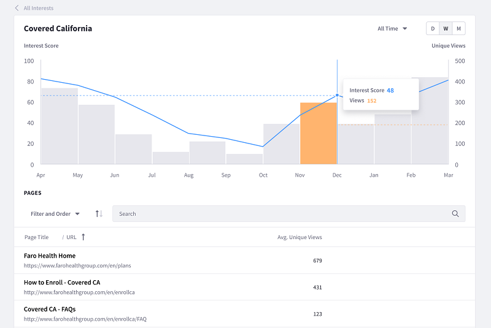
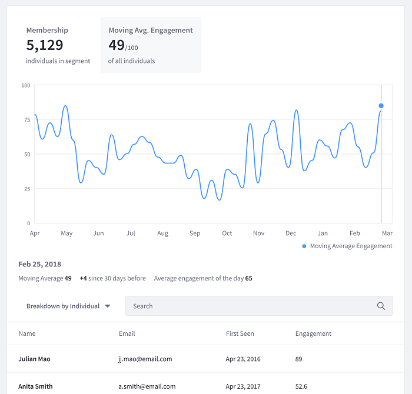
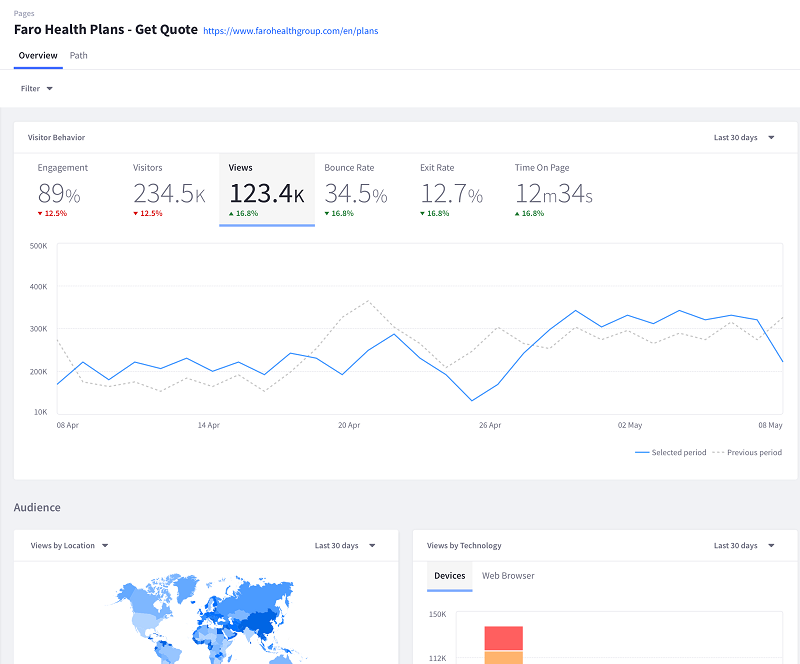

# Welcome to Analytics Cloud

Your company interacts with lots of people, including existing and prospective customers. On your websites they browse products and services, ask questions, leave feedback, and more. Presenting relevant, interesting site content motivates people to do business with you. Knowing your customers well and understanding how they interact with your digital content can help you improve their experience.

Liferay Analytics Cloud is a cloud-based SaaS offering that works with Liferay Digital Experience Platform (Liferay DXP) to give you insights into customer attributes and behavior. It aggregates your data from multiple sources and presents analytics, making it easier to understand people and their interests. The centralized contact data and analytics help you communicate intelligently with people and create terrific user experiences that drive business and make people happier.

## Benefits

Here are key things Analytics Cloud helps you do:

* **Gain a well-rounded view of people:** Analytics Cloud gives you a clear picture of people by aggregating their profile properties and behavior data from multiple sources, including Liferay DXP sites.

* **Identify and track target audiences:** You can focus on characteristics and behaviors common to targeted individuals, aggregate those individuals into Segments, and track Segment growth.

* **Learn people’s interests:** Once you know topics that interest people, you can engage them on those topics. You can also produce stimulating content that highlights how your products and services relate to the topics. These things help you generate new business and improve customer relationships.

* **Measure content performance:** Identify content that gets the most activity so you can build off its success by creating similar content to grow other parts of your business. Spot under-performing content or content issues that prevent people from engaging more deeply with your brand. Fix or improve the content to get people on track, or remove the content from your site.

* **Determine the best advertising channels:** Discover how customers are finding your site pages so you can advertise on the right channels.

These are just some ways you benefit from using Analytics Cloud. Before getting started with Analytics Cloud, you should understand its key components.

Analytics Cloud helps you understand people, their interaction with your sites, and the paths (or channels) that draw them to your sites in these ways:

* [Individuals and Segments](../../individuals-and-segments/individuals-and-segments.md)
* [Touchpoints](../../touchpoints/touchpoints.md)
* [Paths](../../touchpoints/pages/paths.md)

## Individuals and Segments

Existing and prospective customers interact with your company in person, on your websites, and via email and messaging. On Liferay DXP sites, people are registered users or visitors. Analytics Cloud integrates contacts (people) from multiple sources, including Liferay DXP sites, into a single view. It merges contact data into rich profiles of Individuals—unique contacts. You can name contact fields your way, making them most useful to you and your company.

Analytics Cloud lets you aggregate Individuals into Segments. Segments are groups of Individuals with common characteristics. You can create Segments dynamically based on criteria such as industry and location, or statically (comprising hand-selected Individuals). Industry Segment Analytics shows industries engaging with you most and identifies your content that interests them.

Contact profiles are a big part of Analytics Cloud, but analytics about people’s interaction with your website pages and assets is a bigger part. This type of analytics (called Touchpoint Analytics) helps you determine how effective your content is in achieving your business goals.

## Touchpoint Analytics

Touchpoints are the locations (pages) where people interact with content. Here are some of the Touchpoint Analytics:

* **Visitor count:** the number of users (guest and signed in) visiting a Touchpoint.
* **Session length:** amount of time people are spending on a page’s site.
* **Number of sessions:** number of different people on a page’s site.
* **Time on page:** amount of time people are spending on a page.
* **Bounce rate:** percentage of visitors to a particular website who navigate away from the site after viewing only one page.

Assets are specific types of content entities on site pages. Traditional web analytics are based on static websites—everyone sees the same page content. By additionally providing analytics on content articles, Analytics Cloud helps you determine the article effectiveness. It also provides insight into people’s interaction with personalized content. It generates charts on target audience engagement with the content.

Analytics Cloud supports these Liferay DXP Assets:

* [Blogs](../../touchpoints/assets/blogs.md)
* [Documents and Media](../../touchpoints/assets/documents-and-media.md)
* [Forms](../../touchpoints/assets/forms.md)
* [Web Content](../../touchpoints/assets/web-content.md)

Regarding user behavior with a form, for example, Analytics Cloud shows the number of views and submissions, the percentage of users abandoning the form, and the form’s average completion time. A line graph shows the number of views over time.

As you view Page and Asset Analytics you can discern whether an action is positive or negative. Here are some examples.

Positive:

* staying active in sessions
* frequent sign in
* submitting a form
* giving an article five stars

Negative:

* signing out shortly after signing in
* passing by key strategic content
* abandoning a form
* letting a session end

Learning how people get to pages and Assets is also useful. That’s Path Analytics.

## Path Analytics

People get to content through different channels (paths):

* Google search
* Advertisements
* Site navigation
* Search within the site
* Links inside other pages
* Links within Assets

If you expect your advertisements on a channel to draw lots of people to a page, for example, you can check its performance in the page’s Path Analytics. You may learn that a particular social network increasingly drives site traffic, and thus advertise more on that network.

Path Analytics reports the device and browser types that render your site content. It helps you determine which devices and browsers to test more and optimize user experiences on.

You’ve been introduced to Liferay Analytics Cloud and what it offers: Segments, Touchpoints, Paths, and more. It’s time to experience Analytics Cloud for yourself.
