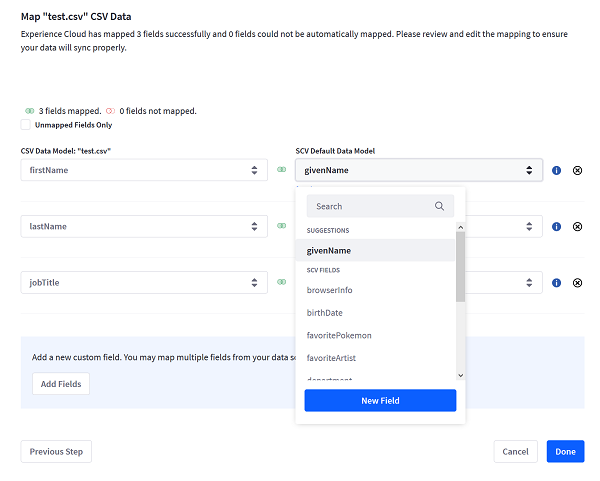
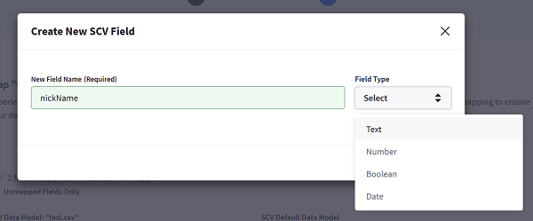

# Mapping Contact Data

Analytics Cloud can map contact profile fields into a unified customer data model. It starts you with a default model. The process for mapping contact data is similar across data source types. Once you’ve selected the contacts to sync, Analytics Cloud makes a best effort to map contact data fields from the data source (e.g., Liferay DXP or CSV) to your unified contact data model.

Analytics Cloud provides several contact data mapping options:

* Choose the most appropriate data model field—Analytics Cloud suggests possible matches.
* Add a new custom data model field and map source data to it.
* Map source fields from multiple data sources to the same data model field.

```note::
   If you map source fields from multiple data sources to the same model field, the latest modified value is used.
```

As you map source fields to the data model, you can search for and select from the data model fields, use a suggested field, or create a new custom field.



Here’s how to create custom contact data model fields:

1. Click on the data model field’s selector.

1. Click *New Field*. A dialog appears for you to create the new field.

1. In the dialog, name the new field and select its type.

1. Click *Create*.

Your custom model field is ready to match with source fields.



When you’re done mapping the data, click the Done button.
