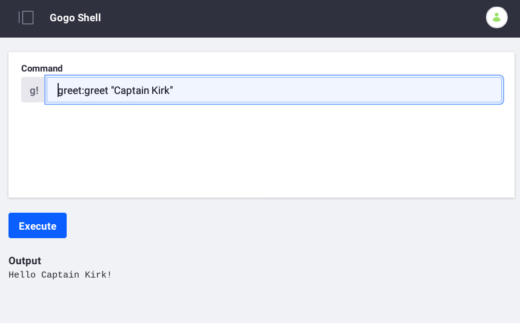

# Understanding Module Projects

When you write customizations or new applications on DXP, you implement them using [OSGi modules](https://www.osgi.org/developer/what-is-osgi/). OSGi modules are `.jar` files containing some extra configuration that enables some powerful features:

* Publishing APIs
* Resolving API implementations
* Ensuring version compatibility

Modules publish their Java packages to the rest of the installed system by declaring them public in their configuration metadata; otherwise, packages are private by default. At runtime, you can use the [Apache Felix Gogo Shell](https://felix.apache.org/documentation/subprojects/apache-felix-gogo.html) to manipulate modules.

Modules follow a standard project structure:

```
[module project]
├── bnd.bnd
├── build.gradle
└── src
    └── main
        ├── java
        │   └── [Java packages]
        └── resources
            └── [any image files, templates, descriptors, etc.]
```

The module project comprises three things:

1. **Code:** Java classes and required resources, such as images, templates, and additional descriptors. Packages are private by default. Packages for other modules to use (such as API packages) are [specified for export](./exporting-packages.md) in the `bnd.bnd` file.

1. **A Build Script:** Specifies required artifacts. Liferay uses Gradle to build modules.

1. **Metadata:** The `bnd.bnd` [Bnd](https://bnd.bndtools.org/) file defines the module artifact and specifies the module's characteristics: capabilities that the module defines, provides, and requires. On building the module JAR file, Bnd propagates configuration metadata from the `bnd.bnd` file to the JAR's `META-INF/MANIFEST.MF` file. When the module is deployed, the runtime framework uses the metadata to add the module's services to the registry and to inject components with the services they reference. Please see [APIs as OSGi Services](./apis-as-osgi-services.md) for more information.

Deploy the following example and examine it to understand module projects.

## Example Modules: Greeting Command

The following modules collectively provide an [Apache Felix Gogo](https://felix.apache.org/documentation/subprojects/apache-felix-gogo.html) shell command that takes a `String` and uses it in a greeting. You'll create a simple API, implementation, and client.



The example demonstrates three common types of modules:

* **API** modules define capabilities using Java interfaces. The interfaces reside in packages that the module exports.
* **Impl** modules provide (implement) API-defined capabilities using concrete Java classes.
* **Client** modules consume API-defined capabilities. The runtime framework injects clients with concrete API implementations.

Here's what you'll do with the example:

1. Launch the Example
1. Examine the API
1. Examine the Impl
1. Examine the Client

## Launch the Example

Start using the example modules.

1. Start a [Liferay Docker container](../../installation-and-upgrades/installing-liferay/using-liferay-dxp-docker-images/dxp-docker-container-basics.md).

    ```bash
    docker run -it -p 8080:8080 liferay/portal:7.3.2-ga3
    ```

1. Download and unzip `liferay-j1h1.zip`.

    ```bash
    curl https://learn.liferay.com/dxp-7.x/liferay-internals/fundamentals/liferay-j1h1.zip -O
    ```

    ```bash
    unzip liferay-j1h1.zip
    ```

    ```note::
       The example includes module sub folders, and a Gradle wrapper and build files that leverage `Liferay Workspace <../../developing-applications/tooling/liferay-workspace.md>`_.
    ```

1. Build the example modules.

    ```bash
    ./gradlew jar
    ```

    Each module JAR file is generated to that module's `build/libs` folder.

     ```
     j1h1-api/build/libs/com.liferay.learn.j1h1.api-1.0.0.jar
     j1h1-client/build/libs/com.liferay.learn.j1h1.client-1.0.0.jar
     j1h1-impl/build/libs/com.liferay.learn.j1h1.impl-1.0.0.jar
     ```

1. Deploy the example module JARs.

    API:

    ```bash
    docker cp j1h1-api/build/libs/com.liferay.learn.j1h1.api-1.0.0.jar $(docker ps -lq):/opt/liferay/deploy
    ```

    Impl:

    ```bash
    docker cp j1h1-impl/build/libs/com.liferay.learn.j1h1.impl-1.0.0.jar $(docker ps -lq):/opt/liferay/deploy
    ```

    Client:

    ```bash
    docker cp j1h1-client/build/libs/com.liferay.learn.j1h1.client-1.0.0.jar $(docker ps -lq):/opt/liferay/deploy
    ```

1. Confirm the deployments in the Docker container console.

    ```
    STARTED com.liferay.learn.j1h1.api_1.0.0
    STARTED com.liferay.learn.j1h1.impl_1.0.0
    STARTED com.liferay.learn.j1h1.client_1.0.0
    ```

1. Go to `http://localhost:8080` and sign in using the default credentials:
   **User Name:** `test@liferay.com`
   **Password:** `test`

1. Open the Gogo Shell by clicking the Applications Menu (), selecting the *Control Panel* tab, and selecting *Gogo Shell* in the System category.

1. In the command field, use the `greet:greet` command to send a greeting.

    ```groovy
    greet:greet "Captain Kirk"
    ```

1. Confirm the output.

    ```
    Hello Captain Kirk!
    ```

The modules work in concert to provide the `greet:greet` Gogo Shell command to greet people. Let's examine each module, starting with the API.

## Examine the API

The API module defines a contract that a provider implements and a consumer uses. Here is its structure:

```
j1h1-api
├── bnd.bnd
├── build.gradle
└── src
    └── main
        └── java
            └── com/acme/j1h1/greeting
                └── Greeting.java
```

Beyond the Java source file, there are only two other files: a Gradle build script and a configuration file called `bnd.bnd`.

The `bnd.bnd` file describes and configures the module.

```properties
Bundle-Name: Acme J1H1 Greeting API
Bundle-SymbolicName: com.liferay.learn.j1h1.api
Bundle-Version: 1.0.0
Export-Package: com.acme.j1h1.greeting
```
The module's name is *Acme J1H1 Greeting API*. Its symbolic name---a name that ensures uniqueness---is `com.liferay.learn.j1h1.api`. Its semantic version is declared next, and its package is [*exported*](./exporting-packages.md), which means it's made available to other modules. This module's package is just an API other modules can implement.

The Java class in this case is an interface:

```java
package com.acme.j1h1.greeting;

import aQute.bnd.annotation.ProviderType;

@ProviderType
public interface Greeting {

	public void greet(String name);

}
```

The interface's [`@ProviderType`](https://docs.osgi.org/javadoc/osgi.annotation/7.0.0/org/osgi/annotation/versioning/ProviderType.html) annotation tells the service registry that anything implementing the interface is a provider. The interface's one method asks for a `String` and doesn't return anything.

The module's `build.Gradle` file specifies its dependencies.

```groovy
dependencies {
	compileOnly group: "com.liferay.portal", name: "com.liferay.portal.kernel"
	compileOnly group: "com.liferay.portal", name: "release.portal.api"
	compileOnly group: "org.osgi", name: "org.osgi.service.component.annotations"
}
```

The `compileOnly` configuration scope means that the dependencies are needed locally at compile time only. Liferay makes them available already at runtime. Liferay provides the dependencies for this API module (and the other modules in this example).

Lastly, notice that no verions are specified for the dependencies. That's because the example and all of its modules are configured to use a specific Liferay version via Liferay Workspace. The modules use the dependency versions that Liferay provides.

The `gradle.properties` file in the parent folder, specifies the Liferay product version. Here's the version used when writing this article:

```properties
liferay.workspace.product=portal-7.3-ga3
```

```note::
   Please see `Configuring Dependencies <./configuring-dependencies/configuring-dependencies.md>`_ and `Finding Artifacts <./configuring-dependencies/finding-artifacts.md>`_ for more information.
```

That's it! As you can see, creating modules is the same as creating other Java projects, with some added configuration.

## Examine the Impl

An interface only defines an API; to do something, it must be implemented. This is what the impl (provider) module does. Here's its structure:

```
j1h1-impl
├── bnd.bnd
├── build.gradle
└── src
    └── main
        └── java
            └── com/acme/j1h1/greeting/impl
                └── GreetingImpl.java
```

It has the same structure as the API module: a build script, a `bnd.bnd` configuration file, and an implementation class.

### Bnd File

The only differences are the file contents. The `bnd.bnd` file is a little different:

```properties
Bundle-Name: Acme J1H1 Greeting Impl
Bundle-SymbolicName: com.liferay.learn.j1h1.impl
Bundle-Version: 1.0.0
```

The bundle name, symbolic name, and version are all set similarly to the API.

Finally, there's no `Export-Package` declaration. A client (which is the third module you'll create) asks for the API: it doesn't care how the implementation works as long as the API returns what it's supposed to return. The service registry injects the appropriate implementation at runtime.

### Code

The Java class that provides the implementation:

```java
package com.acme.j1h1.greeting.impl;

import com.acme.j1h1.greeting.Greeting;

import org.osgi.service.component.annotations.Component;

@Component(immediate = true, service = Greeting.class)
public class GreetingImpl implements Greeting {

	@Override
	public void greet(String name) {
		System.out.println("Hello " + name + "!");
	}

}
```

This simple implementation uses the `String` as a name and prints a hello message. A real implementation might use Liferay's API to collect the names of all users in the system and send each one a greeting notification.

The [`@Component`](https://docs.osgi.org/javadoc/osgi.cmpn/7.0.0/org/osgi/service/component/annotations/Component.html) annotation declares the class as a Declarative Services component, a way of configuring the class without having to use messy configuration files. A component is a POJO that the runtime creates automatically when the module starts.

This `@Component` annotation defines two options:

1. `immediate = true` indicates that this module should not be lazy-loaded; the service registry loads it as soon as it's deployed, instead of when it's first used.

1. `service = Greeting.class` declares the service class that it implements.

### Gradle Build Script

Here's the impl module's build script:

```groovy
dependencies {
	compileOnly group: "com.liferay.portal", name: "com.liferay.portal.kernel"
	compileOnly group: "org.osgi", name: "org.osgi.service.component.annotations"
	compileOnly project(":j1h1-api")
}
```

Its first two dependencies come from Liferay. There's also a dependency on the `j1h1-api` project for accessing its exported package that includes the API that's implemented. The API must be on the class path.

That's all there is to an impl module.

## Examine the Client

The client (or consumer) module uses the API that the API module defines and the impl module implements. Liferay has many different kinds of consumer modules, with portlets as the most common consumer module type. This simple example creates a command for the Apache Felix Gogo shell. Note that consumers can use as many different APIs as it needs to provide functionality.

A consumer module has the same structure as the other module types:

```
j1h1-client
├── bnd.bnd
├── build.gradle
└── src
    └── main
        └── java
            └── `com/acme/j1h1/greeting/command`
                └── `GreetingCommand.java`
```

Again, you have a build script, a `bnd.bnd` file, and a Java class. This module's `bnd.bnd` file is almost the same as the provider's:

```properties
Bundle-Name: Acme J1H1 Greeting Command
Bundle-SymbolicName: com.liferay.learn.j1h1.client
Bundle-Version: 1.0.0
```

There's nothing new here: you declare the same things you declared for the impl.

Here's the Java class:

```java
package com.acme.j1h1.greeting.command;

import com.acme.j1h1.greeting.Greeting;

import org.osgi.service.component.annotations.Component;
import org.osgi.service.component.annotations.Reference;

@Component(
	immediate = true,
	property = {"osgi.command.scope=greet", "osgi.command.function=greet"},
	service = Object.class
)
public class GreetingCommand {

	public void greet(String name) {
		Greeting greeting = _greeting;

		greeting.greet(name);
	}

	@Reference
	private Greeting _greeting;

}
```

The `@Component` annotation declares the same `immediate = true` attribute, but specifies a different `service` value and some properties.

* `service = Object.class` TODO
`Object` is used because there is
As in Java, where every class is a subclass of `java.lang.Object` (even though you don't need to specify it by default), in Declarative Services, the runtime must know the type of class to register. Because you're not implementing any particular type, your parent class is `java.lang.Object`, so you must specify that class as the service. While Java doesn't require you to specify `Object` as the parent when you're creating a class that doesn't inherit anything, Declarative Services does.

The two properties define a Gogo shell command scope and a command function. All commands have a scope to define their context, as it's common for multiple APIs to have similar functions, such as `copy` or `delete`. These properties specify you're creating a command called `greet` in a scope called `greet`. While you get no points for imagination, this sufficiently defines the command.

Since you specified `osgi.command.function=greet` in the `@Component` annotation, your class must have a method named `greet`, and you do. This method obtains an instance of the `Greeting` OSGi service and invokes its `greet` method, passing in the `name` parameter. To retrieve an instance of the OSGi `Greeting` service, the `GreetingCommand` class declares a private service bean, `_greeting` of type `Greeting`. This is the OSGi service type that the provider module registers. The [`@Reference`](https://docs.osgi.org/javadoc/osgi.cmpn/7.0.0/org/osgi/service/component/annotations/Reference.html) annotation tells the OSGi runtime to instantiate the service bean with a service from the service registry. The runtime binds the `Greeting` object of type `GreetingImpl` to the private field `_greeting`. The `greet` method uses the `_greeting` field value.

Here's the client's build script:

```groovy
dependencies {
	compileOnly group: "com.liferay.portal", name: "com.liferay.portal.kernel"
	compileOnly group: "org.osgi", name: "org.osgi.service.component.annotations"
	compileOnly project(":j1h1-api")
}
```

Just like the impl module, the client module must have the API on its classpath in order to compile, but at runtime, since you've declared all the dependencies appropriately, the container knows about these dependencies and provides them automatically.

This most basic of examples should make it clear that module-based development is clear for any Java developer. The API-Provider-Consumer contract fosters loose coupling, making your software easy to manage, enhance, and support.

## What's Next

Now that you're familiar with module projects, you can explore how to [configure dependencies](./configuring-dependencies/configuring-dependencies.md). Also, you can dive deeper into developing [APIs as OSGi services](./apis-as-osgi-services.md).

## Additional Information

* [Importing Packages](./importing-packages.md)
* [Exporting Packages](./exporting-packages.md)
* [Semantic Versionings](./semantic-versioning.md)