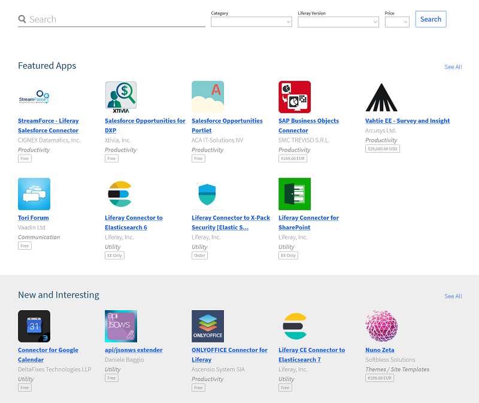

# App Management Overview 

As you get the itch for new [themes](https://help.liferay.com/hc/en-us/articles/360029045971-Themes), [widgets/portlets](https://help.liferay.com/hc/en-us/articles/360029046351-Introduction-to-Portlets), [layout templates](https://help.liferay.com/hc/en-us/articles/360017887812-Layout-Templates), and APIs, you can [develop and deploy your own](https://marketplace.liferay.dev/) or purchase them as apps from the [Liferay Marketplace](./02-using-the-liferay-marketplace.md).

From Marketplace, you can download and install apps automatically on purchase or anytime after purchase. You can use the Control Panel to install apps or copy the app files to your DXP installation for auto deployment. DXP facilitates managing your apps, their UI components, and modules. 

Here are the app management topics:

- [Using the Liferay Marketplace](./02-using-the-liferay-marketplace.md): The Marketplace facilitates discovering and downloading apps for DXP. It provides descriptions, screenshots, requirements, reviews, and resource links for apps for DXP versions.

- [Installing Apps](./03-installing-apps.md): For casual purposes the Control Panel is the most convenient way to install apps. For production and other formal environments (e.g., DXP in a cluster), best installation practices are presented to maximize stability. All of the installation approaches are demonstrated.

- [Managing Apps and App Components](./04-managing-apps-and-app-components.md): After installing an app, you can examine the app and its modules and components, deactivate the app, or uninstall it. App UI Components (themes, portlets, and layout templates) can be configured with desired permissions, disabled, and enabled.

- [Blacklisting Modules and OSGi Components](./05-blacklisting-modules-and-osgi-components.md): Apps comprise [modules](https://help.liferay.com/hc/en-us/articles/360035467532-OSGi-and-Modularity#modules) and modules can comprise [OSGi Declarative Service Components](https://help.liferay.com/hc/en-us/articles/360028846452-Declarative-Services). Blacklisting facilitates managing them across DXP servers startup and in a DXP cluster.
